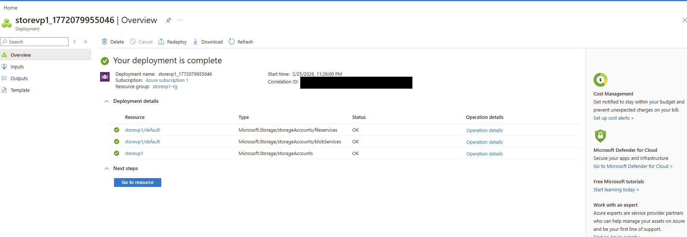
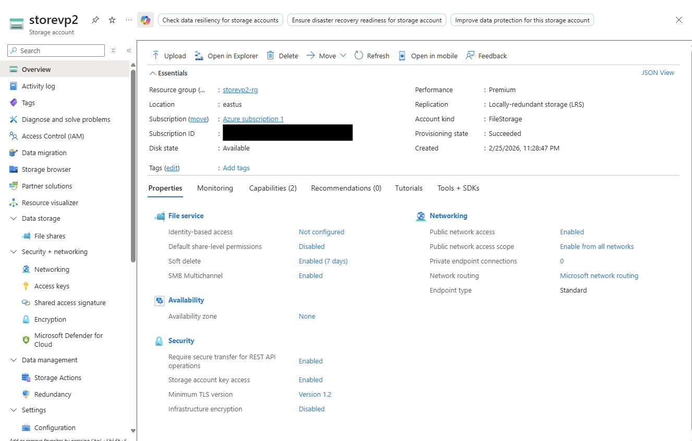
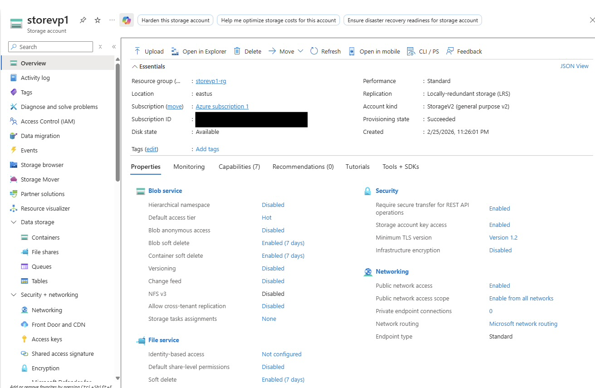

# Lab 05: Storage Account + File Share

## Objective
Create an Azure Storage Account and review its deployment and configuration in the Azure Portal.

## Resources Created
- Azure Storage Account

## Prerequisites
- Existing Azure tenant + subscription
- Contributor permissions
- Access to the Azure Portal

## Naming Used
- Storage Account: storevp1 / storevp2
- Resource Group: storevp1-rg / storevp2-rg

## Deployment Steps (Azure Portal)
1. In the Azure Portal, search for **Storage accounts**.
2. Click **Create**.
3. Select your subscription.
4. Create or select a resource group.
5. Enter a globally unique storage account name.
6. Select a region.
7. Set **Performance** and **Redundancy** based on the lab requirements.
8. Click **Review + create**.
9. Click **Create**.

## Validation
- Confirm the deployment completed successfully.
- Confirm the storage account appears in the resource group.
- Review the storage account overview and properties in the portal.

## Screenshots

### Storage Account Deployment

### Storage Account Overview

### Storage Account Configuration

## Cleanup
1. Navigate to the resource group.
2. Select the storage account.
3. Delete the resource if no longer needed.

## Notes / What I Learned
- Storage account names must be globally unique.
- Storage accounts can be configured with different performance and redundancy options.
- The Azure Portal provides deployment validation and resource overview information.
- Azure Storage supports multiple services such as Blob, File, Queue, and Table within a single StorageV2 account.
